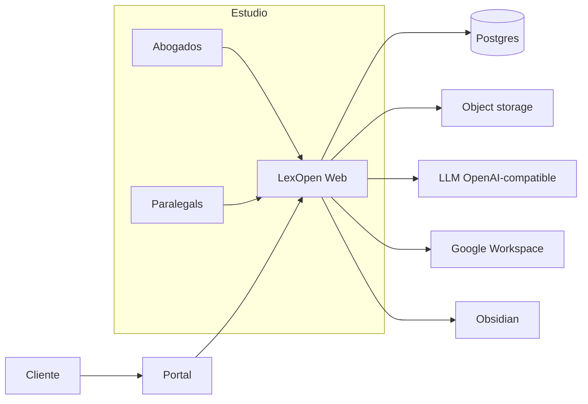

<p align="center">
  
</p>

<h1 align="center">LexOpen</h1>

<p align="center">
  <strong>Legal workspaces open-source para Chile</strong><br/>
  Clon inspirado en <a href="https://legal.thomsonreuters.com/en/products/highq">Thomson Reuters HighQ</a>,
  con capa nativa de litigio chileno, CRM, facturación e IA multi-proveedor.
</p>

<p align="center">
  <a href="https://github.com/gabrielperezibacache/lexopen/blob/main/LICENSE"></a>
  <a href="https://nextjs.org/"></a>
  <a href="https://www.postgresql.org/"></a>
  <a href="https://www.typescriptlang.org/"></a>
  <a href="#despliegue-en-render"></a>
</p>

<p align="center">
  <a href="#inicio-rápido">Inicio rápido</a> ·
  <a href="#mapa-del-producto">Mapa del producto</a> ·
  <a href="#asistente-ia">Asistente IA</a> ·
  <a href="#api">API</a> ·
  <a href="#contribuir">Contribuir</a>
</p>

---

<p align="center">
  
</p>

<p align="center">
  
</p>

> **Disclaimer:** LexOpen no está afiliado a Thomson Reuters. HighQ es marca de terceros.
> El software se ofrece bajo **AGPL-3.0-or-later**.

---

## ¿Por qué LexOpen?

Los estudios chilenos necesitan algo más que un drive compartido: **matters**, plazos fatales, handoffs entre abogados, carpeta del cliente y un asistente que entienda el expediente — sin vendor lock-in.

| Dolor del estudio | LexOpen |
| --- | --- |
| HighQ / iManage caros o inaccesibles | Espacios, VDR, wiki, iSheets y portal **open-source** |
| Causas sin RIT/RUC ni plazos hábiles | Módulo Chile: causas, plazos, minutas, jurisprudencia |
| El cliente “está en WhatsApp y carpetas” | **CRM**: cliente → causas → trámites → documentos |
| IA genérica sin contexto del caso | Acciones IA + chat por carpeta / causa (OpenAI-compatible) |
| Facturación aparte del matter | Horas, gastos, boletas/facturas, UF, cuenta corriente |



---

## Mapa del producto

<p align="center">
  
</p>

### HighQ → LexOpen

| Módulo HighQ | En LexOpen |
| --- | --- |
| **Sites / Workspaces** | Matters, VDR, knowledge, client portal, projects |
| **Files / VDR** | Carpetas, archivos, versionado, comentarios, tags |
| **iSheets** | Tablas tipadas con filas editables |
| **Tasks & Calendar** | Tasks por site + calendario con plazos Chile |
| **Wiki / Blog** | Markdown por site + borrador IA |
| **Q&A** | Hilos cliente/equipo con respuesta oficial |
| **Workflows** | Aprobaciones multi-paso |
| **People / Groups** | Usuarios, roles de site, grupos |
| **Messages & Notifications** | Mensajería interna + alertas |
| **Client portal** | Sites `isClientVisible` + docs etiquetados |
| **Search** | Índice unificado (sites, causas, files, tasks, wiki, clientes, trámites…) |
| **Activity stream** | Feed por site y global |
| **APIs** | REST bajo `/api/*` |

### Capa Chile + práctica del estudio

- **Causas** — RIT/RUC, tribunal, materia, etapa, partes, conflictos de interés  
- **Minutas de handoff** — wizard post-audiencia / reunión / llamada → tasks y plazos  
- **Plazos procesales** — cómputo hábil/corrido, fatales, sync Google Calendar  
- **CRM de clientes** — ficha, causas, trámites pendientes/hechos, documentos de carpeta  
- **Documentos** — por causa o cliente; Drive real vs stub/demo  
- **Jurisprudencia** — corpus demo CS / Apelaciones / TC + brief IA  
- **Facturación** — horas, gastos, tarifas, boletas/facturas (IVA/retención), UF, pagos, cuenta corriente  
- **Asistente IA** — multi-proveedor + acciones puntuales en cada módulo  
- **Integraciones** — Obsidian, Google Workspace, Hermes / cualquier endpoint Chat Completions  

<p align="center">
  
</p>

---

## Capturas del recorrido

> Interfaz en español, tipografía editorial y paleta **ink / sea / copper** (sin el look genérico “AI purple”).

| Módulo | Qué verás al arrancar el seed |
| --- | --- |
| **Dashboard** | Causas activas, plazos, trámites pendientes, actividad |
| **Clientes** | CRM con carpeta + chat IA contextual |
| **Causas** | RIT, partes, minutas, trámites, Drive, acciones IA |
| **Espacios** | Matter Andes, VDR Pacífico, Knowledge, Portal cliente |
| **Facturación** | Emisión con glosa asistida por IA |
| **Configuración** | LLM (OpenAI, Azure, Groq, Ollama, Hermes, custom) |

---

## Asistente IA

LexOpen no es “un chat más”: es un **catálogo de acciones** con contexto del expediente.

| Acción | Dónde | Efecto |
| --- | --- | --- |
| `causa.resumen` | Ficha de causa | Resumen procesal + próximos pasos |
| `causa.sugerir_tramites` | Causa / panel trámites | Crea checklist pendiente |
| `causa.extraer` | Alta de causa | Rellena RIT, tribunal, partes… |
| `minuta.borrador` | Wizard de minuta | Prefills hechos, acuerdos, acciones |
| `documento.resumir` / `clasificar` | Documentos | Memo / tipo sugerido |
| `plazo.sugerir` | Plazos | Prefills cómputo y fatales |
| `jurisprudencia.brief` | Jurisprudencia | Brief sobre la consulta |
| `factura.glosa` | Facturación | Glosa profesional CL |
| `mensaje.borrador` | Mensajes | Asunto + cuerpo |
| `wiki.borrador` | Wiki del site | Playbook Markdown |

```bash
# Listar acciones
curl localhost:3000/api/ai/actions

# Ejecutar (sesión staff + CSRF same-origin)
curl -X POST localhost:3000/api/ai/actions \
  -H 'content-type: application/json' \
  -d '{"action":"causa.resumen","causaId":"<id>"}'
```

Configure el proveedor en **Configuración** o vía env:

```env
LLM_API_URL=https://api.openai.com/v1
LLM_API_KEY=sk-...
LLM_MODEL=gpt-4o-mini
LLM_ALLOW_DEMO=1   # respuestas demo si el proveedor no responde
```

Presets: **OpenAI · Azure · Groq · Ollama · Hermes · custom** (cualquier API compatible con Chat Completions).

---

## Stack

```text
Next.js 15 (App Router) · React 19 · TypeScript
Tailwind CSS 4 · Prisma 5 · PostgreSQL
Zod · bcrypt sessions · S3-compatible storage (opcional)
Deploy: Render Blueprint (render.yaml)
Licencia: AGPL-3.0-or-later
```

---

## Inicio rápido

### Requisitos

- Node.js 20+ (22 recomendado en Render)
- PostgreSQL 14+
- npm

### 60 segundos

```bash
git clone https://github.com/gabrielperezibacache/lexopen.git
cd lexopen
cp .env.example .env
# Edite DATABASE_URL y SESSION_SECRET

npm install
npm run db:migrate
npm run db:seed    # datos demo HighQ + Chile
npm run dev
```

Abra **http://localhost:3000/login**.

> En producción: `npm run db:migrate` en el deploy; **no** ejecute seed automáticamente.  
> El filesystem local es efímero en PaaS — use S3/R2/MinIO para documentos.

### Usuarios demo

Password de todos: `lexopen`

| Email | Rol |
| --- | --- |
| `socio@estudio.cl` | admin / socia |
| `abogado@estudio.cl` | abogado |
| `asistente@estudio.cl` | paralegal |
| `cliente@andes.cl` | cliente (portal) |

Cambie de usuario con el switcher inferior del sidebar (`LEXOPEN_DEMO_SWITCHER=1` en local).

### Sites demo incluidos

- Matter Andes · Cobro `C-4521-2025`  
- Matter Muñoz · Tutela `O-1189-2025`  
- VDR Due Diligence Pacífico  
- Knowledge · Jurisprudencia & Playbooks  
- Portal Cliente · Constructora Andes  

---

## Variables de entorno

| Variable | Uso |
| --- | --- |
| `DATABASE_URL` | Postgres (obligatorio) |
| `SESSION_SECRET` | Sesiones + protección OAuth (obligatorio en prod) |
| `LLM_API_URL` / `LLM_API_KEY` / `LLM_MODEL` | Proveedor IA OpenAI-compatible |
| `LLM_ALLOW_DEMO` | `1` = fallback demo si el LLM cae |
| `HERMES_*` | Legacy Hermes (sigue soportado) |
| `GOOGLE_CLIENT_ID` / `SECRET` / `REDIRECT_URI` | Drive / Calendar / Gmail |
| `OBSIDIAN_VAULT_PATH` | Export Markdown |
| `S3_*` | Object storage (opcional) |
| `PORT` | Bind `0.0.0.0:$PORT` (Render) |

Ver `.env.example` para el set completo.

---

## API (muestra)

```bash
# CRM
curl localhost:3000/api/clientes
curl -X POST localhost:3000/api/causas/<id>/tramites \
  -H 'content-type: application/json' \
  -d '{"titulo":"Preparar lista de testigos","estado":"pendiente"}'

# IA sobre carpeta de cliente
curl -X POST localhost:3000/api/clientes/<id>/ai \
  -H 'content-type: application/json' \
  -d '{"prompt":"Resume los trámites pendientes"}'

# Sites / VDR / iSheets
curl localhost:3000/api/sites
curl -X POST localhost:3000/api/sites/<id>/files \
  -H 'content-type: application/json' \
  -d '{"action":"create-file","name":"Memo.md","contenido":"# Hola"}'
curl localhost:3000/api/sites/<id>/isheets

# Búsqueda
curl 'localhost:3000/api/search?q=tutela'

# Obsidian + Drive + Minutas
curl -X POST localhost:3000/api/integrations/obsidian \
  -H 'content-type: application/json' -d '{"action":"sync-all"}'
curl -X POST localhost:3000/api/integrations/google \
  -H 'content-type: application/json' \
  -d '{"action":"link-causa-folder","causaId":"<id>","folderRef":"https://drive.google.com/drive/folders/…"}'
curl -X POST localhost:3000/api/minutas \
  -H 'content-type: application/json' \
  -d '{"causaId":"<id>","tipo":"audiencia","titulo":"Audiencia de prueba","resumenEjecutivo":"…","acciones":[{"descripcion":"Presentar lista de testigos","crearPlazo":true,"fechaLimite":"2026-08-01"}]}'
```

Healthcheck: `GET /api/health`.

---

## Despliegue en Render

El repo incluye [`render.yaml`](render.yaml):

1. New → Blueprint → seleccione este repositorio  
2. Postgres managed + web service Node  
3. Configure secretos (`LLM_*`, Google, S3…) en el Dashboard  
4. Deploy ejecuta `prisma migrate deploy` + `npm run build`  
5. Bind HTTP en `0.0.0.0:$PORT` (ya configurado en `npm start`)

```bash
# Local mirror del start productivo
npm run build && npm run start
```

---

## Scripts

| Comando | Descripción |
| --- | --- |
| `npm run dev` | Desarrollo (Turbopack) |
| `npm run build` / `start` | Producción |
| `npm test` | Suite (Chile, plazos, minutas, LLM, IA, e2e smoke) |
| `npm run db:migrate` | Migraciones Prisma |
| `npm run db:seed` | Datos demo |
| `npm run db:reset` | Reset + seed (solo local) |
| `npm run setup` | `db push` + seed rápido |

---

## Roadmap (abierto)

- [ ] Conectores PJUD / fuentes oficiales (sin scraping agresivo)  
- [ ] Plantillas de escritos y exportación DOCX  
- [ ] SSO / SAML para estudios grandes  
- [ ] Multi-tenant por estudio  
- [ ] App móvil / PWA offline para audiencias  
- [ ] Marketplace de playbooks comunitarios  

¿Ideas? Abra un [issue](https://github.com/gabrielperezibacache/lexopen/issues) o un PR.

---

## Contribuir

Lea [`CONTRIBUTING.md`](CONTRIBUTING.md).

1. Fork → rama `feat/<nombre>` o `cursor/<feature>-xxxx`  
2. `npm run setup && npm run dev`  
3. UI en **español chileno**; sin secretos en commits  
4. PR describiendo módulos tocados  

```bash
npm test
npm run build
```

---

## Licencia

**AGPL-3.0-or-later** — ver [`LICENSE`](LICENSE).

Si modifica LexOpen y lo ofrece como servicio en red, debe publicar el código fuente correspondiente bajo la misma licencia.

---

<p align="center">
  
  <br/>
  <sub>Hecho para estudios en Chile · Open source · Sin vendor lock-in</sub>
  <br/><br/>
  <a href="https://github.com/gabrielperezibacache/lexopen/stargazers">⭐ Star</a>
  ·
  <a href="https://github.com/gabrielperezibacache/lexopen/fork">Fork</a>
  ·
  <a href="https://github.com/gabrielperezibacache/lexopen/issues">Issues</a>
</p>
